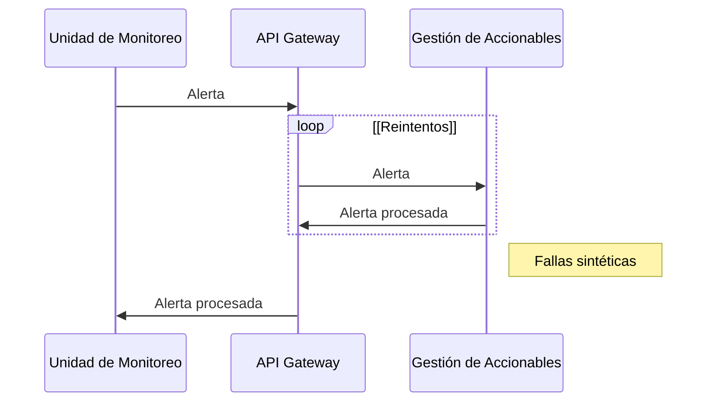
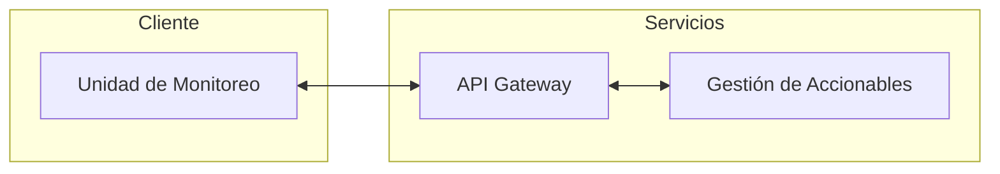

# Experimento 1

Disponibilidad

## Objetivo

Validar si durante operación normal del sistema, y en presencia de fallas de comunicación la señal del botón de pánico es procesada por lo menos el 99.95% de las veces.

## Diseño

Visualización del experimento:

## Descripción Tecnológica

Se utiliza docker para orquestar el levantamiento de los tres componentes.

1. API Gateway: nginx configurado para apuntar a los servicios internos.
2. Gestión de accionables: receptor de las acciones
3. Unidad de monitoreo: generador de acciones

## Instrucciones

Requerimientos: docker

1. `docker compose up --build`
2. Hacer http request de prueba: `curl http://127.0.0.1:8080/comandos/gestion_accionables/`
