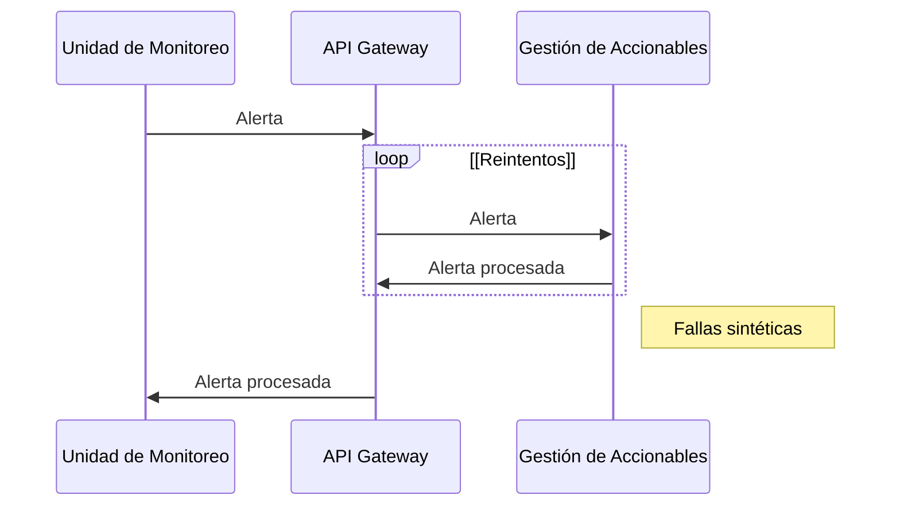
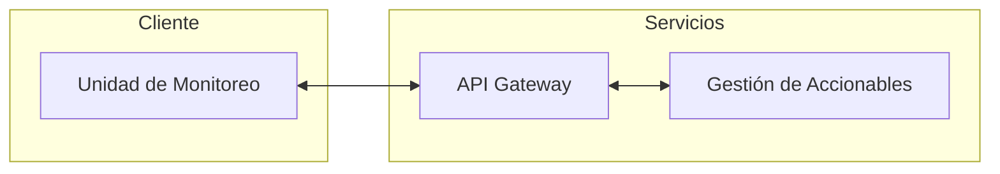

# Experimento 1

Disponibilidad


## Objetivo

Validar si durante operación normal del sistema, y en presencia de fallas de comunicación la señal del botón de pánico es procesada por lo menos el 99.95% de las veces.

## Diseño

Visualización del experimento:





## Descripción Tecnológica

Se utiliza docker para orquestar el levantamiento de los tres componentes.

1. API Gateway: nginx configurado para apuntar a los servicios internos.
2. Gestión de accionables: receptor de las acciones
3. Unidad de monitoreo: generador de acciones

## Instrucciones

Requerimientos: docker

Para correr el experimento solo es necesario dos pasos.

1. En un terminal levantar el experimento: `docker compose up --build`
2. En otro terminal comenzar la prueba: `curl http://localhost:8082/start `

Luego se puede ver en el terminal 1 que se están enviando requests de pruebas desde la unidad de monitoreo, pasando por el api gateway, y luego llegando a gestion de accionables. Una vez se hallan enviado los request de prueba cien (100) por defecto, se puede ver en los logs el siguiente mensaje:

```
unidad_monitoreo            | [2022-09-11 13:34:11,025] INFO in app: Stress test finished
```

Y ahora se pueden ver los resultados de envíos en [`./services/unidad_monitoreo/input.csv`](./services/unidad_monitoreo/input.csv) y como fueron procesados en
[`./services/gestion_accionables/responses.csv`](./services/gestion_accionables/responses.csv)

Estructura de resultados:

CSV con los siguientes datos:

* id: identificador único del request
* start: fecha de inicio de procesamiento
* end: fecha de final de procesamiento
* delta: milisegundos de procesamiento
* status: si se proceso exitosamente o no (`response  == HTTP 200`)

## [Análisis](./analisis/analisis.ipynb)

Se puede ver el procesamiento [en el siguiente cuaderno](./analisis/analisis.ipynb)
