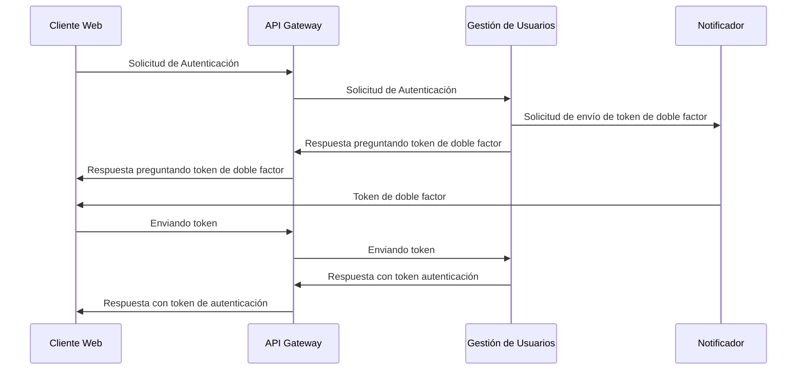
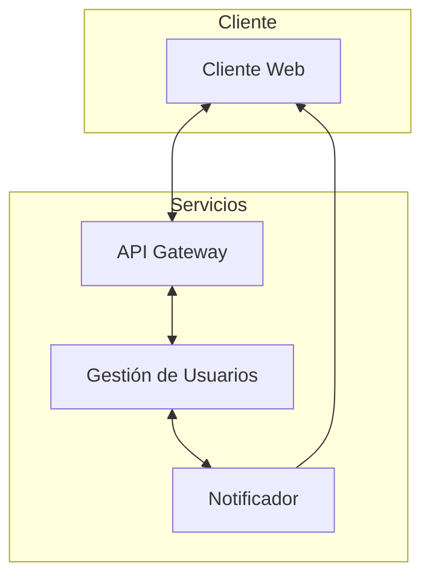

# Experimento 2

Seguridad


## Objetivo

Validar la autenticación de la plataforma, garantiza la confidencialidad y evita la suplantación con medidas de doble factor.

## Diseño

Escenario válido de autenticación:





## Descripción Tecnológica

Se utiliza docker para orquestar el levantamiento de los cuatro componentes.

1. Cliente Web: quien intenta autenticarse
2. API Gateway: nginx configurado para apuntar a los servicios internos.
3. Gestión de Usuarios: receptor de comandos de autenticación
4. Notificador: entrega los token al cliente para que se valide


## Instrucciones

Requerimientos: docker

Para correr el experimento solo es necesario dos pasos.

1. En un terminal levantar el experimento: `docker compose up --build`

<details>
<summary>NOTA: Si recibe el siguiente error:</summary>

```bash
Error response from daemon: Conflict. The container name "/api_gateway" is already in use by container "ae10d3". You have to remove (or rename) that container to be able to reuse that name.
```

Necesita eliminar una versión anterior de este contenedor con el comando `docker container rm --force api_gateway`

Es probable que le ocurra con otros contenedores anteriores que quizás estén usando los mismos puertos, puede hacer el mismo procedimiento  `docker container rm --force {nombre de contenedor a eliminar}`
</details>

### Enviar Solicitudes

Para enviar una solicitud a los diferentes contenedores:

```bash
# Cliente Web
curl localhost:8081
# Api Gateway
curl localhost:8080
# Gestión de usuarios (A traves del API Gateway)
curl localhost:8080/comandos/gestion_usuarios/
# Gestión de usuarios por fuera del API Gateway
curl localhost:8083
# Notificador (A traves del API Gateway)
curl localhost:8080/comandos/notificador/
# Notificador por fuera del api gateway
curl localhost:8082
```

### Ejecutar experimento

- Ejecución de tests login
`curl localhost:8081/start?calls=<num_calls>`
donde <num_calls> son el número de peticiones a realizar

### Escenarios propuestos

- [ 401 ] Usuario invalido

> Usuario y/o contraseña inválida. Para el contexto del experimento => donde usuario <> contraseña

- [ 200 ] Usuario valido

> Usuario y contraseña valida. Para el contexto del experimento => donde usuario == contraseña

- [ 200 ] Autenticación valida

> Se recibe Token de doble factor y se recibe Match satisfactorio

- [ 200 ] Acceso satisfactorio

> Se recibe Token JWT y se logra acceder a un recurso protegido

- [ 401 ] Detección de doble factor nulo

> Se realiza una petición con Token de doble factor nulo

- [ 401 ] Detección de doble factor invalido

> Se realiza una petición con Token de doble factor generado por fuera del componente **gestión de usuarios**

- [ 401 ] Detección de match incorrecto de doble factor con usuario valido

> Se realiza una petición con usuario B pero con Token de doble factor valido para el usuario A, donde B y A son un usuarios validos

- [ 401 ] Detección de match incorrecto de doble factor con usuario invalido
 
> Se realiza una petición con usuario B pero con Token de doble factor valido para el usuario A, donde A es un usuario valido y B un usuario invalido

### Resultados

> results.csv: registra la siguiente estructura:
> "id", "start", "end", "delta", "status", "request", "response", "type", "expected", "received", "assert"
> type: escenario propuesto
> expected: valor esperado
> received: valor recibido
> assert: resultado de comparación entre lo esperado y lo recibido

> Analisis.xlsx: cuadro de análisis
> hoja **escenarios**: listado de escenarios propuestos
> hoja **results**: importación en tabla de registros de results.csv
> hoja **Hoja1**: tabla dinámica indicando para cada escenario los valores esperados, recibidos y el resultado del assert, si fue verdadero o falso. Adicionalmente una tabla dinámica y una gráfica indicando el porcentaje de asserts verdaderos y falsos

### Actualización de Resultados
**Resultados:** se genera el archivo results.csv en la ruta exp2/services/cliente_web al solicitar la ejecución del experimento

**Análisis:** se abre el archivo analisis.xlsx desde excel
``` 
- Actualizar origen de datos
Se debe actualizar la tabla de excel en la hoja “results” por el path local de ejecución
Ir a pestaña Datos / Obtener datos / Configuración de origen de datos
Seleccionar ítem “..../results.csv”
Seleccionar “cambiar origen”
Seleccionar “Ruta de acceso al archivo” y escoger el archivo results.csv generado localmente
“Aceptar”
```
``` 
- Actualizar datos
Ir a hoja “results”
Ir a pestaña “Diseño de tabla”
Click en “Actualizar”
```
``` 
- Actualizar tablas dinámicas y gráficos
Ir a hoja “Hoja1”
Seleccionar una de las tablas dinámicas
Ir a pestaña “Analizar tabla dinámica”
Click “Actualizar”
```
