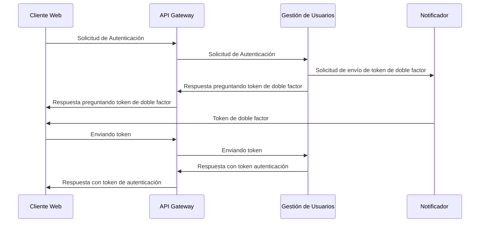
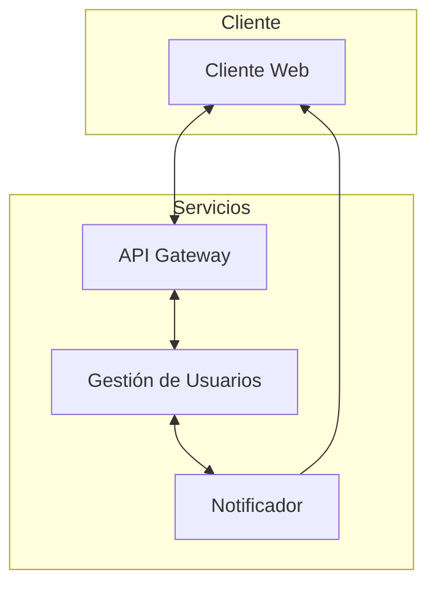

# Experimento 2

Seguridad


## Objetivo

Validar la autenticación de la plataforma, garantiza la confidencialidad y evita la suplantación con medidas de doble factor.

## Diseño

Escenario válido de autenticación:





## Descripción Tecnológica

Se utiliza docker para orquestar el levantamiento de los cuatro componentes.

1. Cliente Web: quien intenta autenticarse
2. API Gateway: nginx configurado para apuntar a los servicios internos.
3. Gestión de Usuarios: receptor de comandos de autenticación
4. Notificador: entrega los token al cliente para que se valide


## Instrucciones

Requerimientos: docker

Para correr el experimento solo es necesario dos pasos.

1. En un terminal levantar el experimento: `docker compose up --build`

<details>
<summary>NOTA: Si recibe el siguiente error:</summary>

```bash
Error response from daemon: Conflict. The container name "/api_gateway" is already in use by container "ae10d3". You have to remove (or rename) that container to be able to reuse that name.
```

Necesita eliminar una versión anterior de este contenedor con el comando `docker container rm --force api_gateway`

Es probable que le ocurra con otros contenedores anteriores que quizás estén usando los mismos puertos, puede hacer el mismo procedimiento  `docker container rm --force {nombre de contenedor a eliminar}`
</details>

### Enviar Solicitudes

Para enviar una solicitud a los diferentes contenedores:

```bash
# Cliente Web
curl localhost:8081
# Api Gateway
curl localhost:8080
# Gestión de usuarios (A traves del API Gateway)
curl localhost:8080/comandos/gestion_usuarios/
# Gestión de usuarios por fuera del API Gateway
curl localhost:8083
# Notificador (A traves del API Gateway)
curl localhost:8080/comandos/notificador/
# Notificador por fuera del api gateway
curl localhost:8082
```
