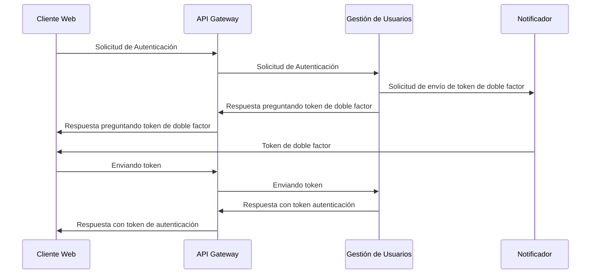
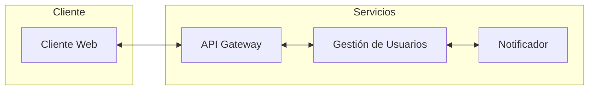

# Experimento 2

Seguridad

## Objetivo

Validar la autenticación de la plataforma, garantiza la confidencialidad y evita la suplantación con medidas de doble factor.

## Diseño

Escenario válido de autenticación:

## Descripción Tecnológica

Se utiliza docker para orquestar el levantamiento de los cuatro componentes.

1. Cliente Web: quien intenta autenticarse
2. API Gateway: nginx configurado para apuntar a los servicios internos.
3. Gestión de Usuarios: receptor de las acciones
4. Notificador: entrega los token al cliente para que se valide
